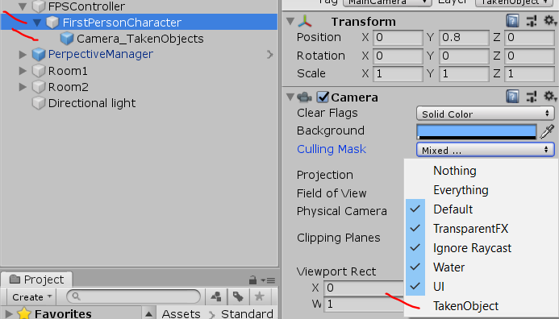

# Forced-Perspective-Illusion-Mechanic-for-Unity
This is a single script project that simulates forced perspective illusion, like Pillow Castle's puzzle game.

# Explanning the illusion
In forced perspective optical illusions objects that are farther away appear smaller than it actually is. In this puzzle scene, once the object that is away from the player is "taken", the visual scale is forced on the object to make it appear to be the same size, once the object is dropped, it is possible to notice that the object was scaled in relation to the farther background.
This project was made to test the possibility to create such illusion on Unity.
Example:

# Settings
* The PerspectiveManager prefab have all is needed in terms of scripting of the illusion
* Add a layer called TakenObject
* The player should have the camera attached to it, as first or third person
* Have a second camera, child of the main camera
* Main camera with Culling Mask set to ignore TakenObject layer

* Child camera with Culling Mask set to only show TakenObject layer

# See in action

https://youtu.be/yC09uuTZTSc

# Issues
* The calculation is done in real time inside the Update function, it is costly and inefective.
* If the angle of the background in relation to the raycast or the distance of the object changes too rapidly, it causes some glitches because of the real time calculation.
* There is a need for a lerp on the object positioning and in the target position of the object so the calculation can converge.
* My pc was too slow to record a video without lagging the gameplay =(

# Used pieces of assets
* FPSController from Unity's Standard Assets
* Chair and Cabinet from Free Furniture Set
* Barrel, Crate, Shield and Axe from Low Poly Megapack - Lite
